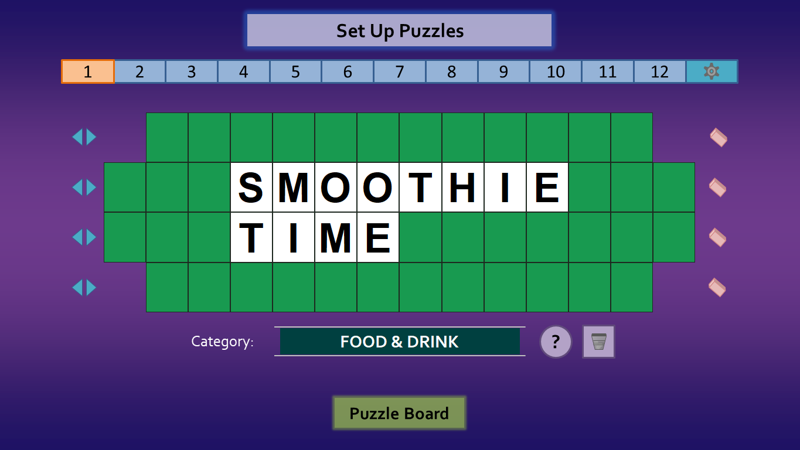
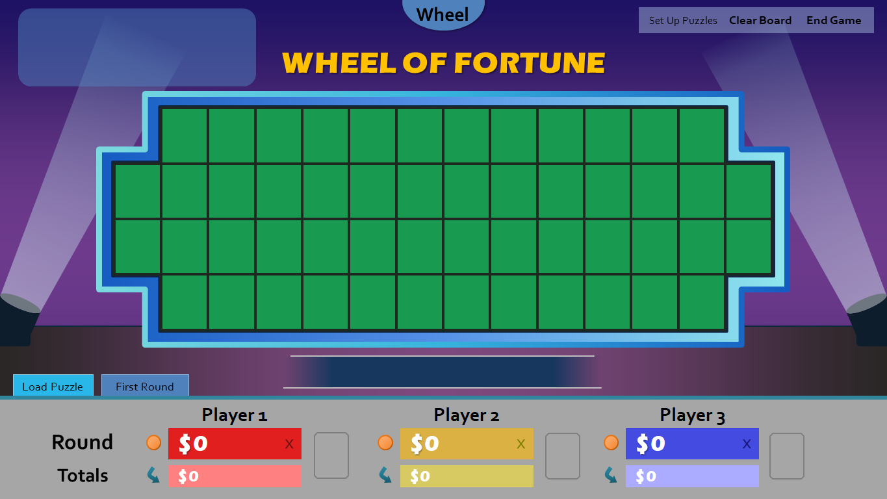
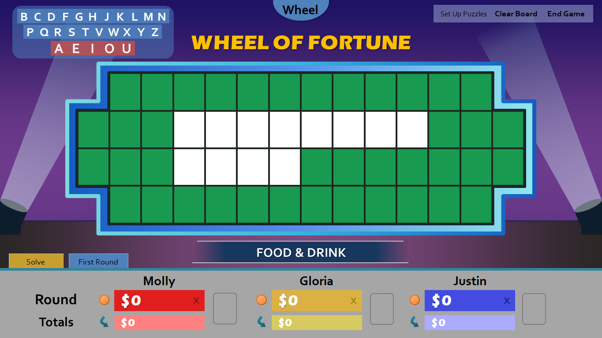
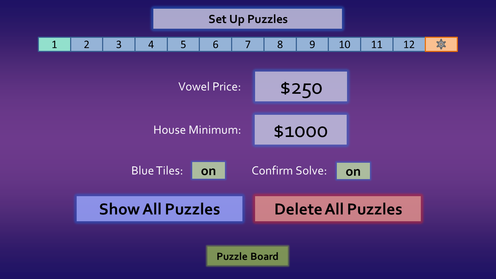
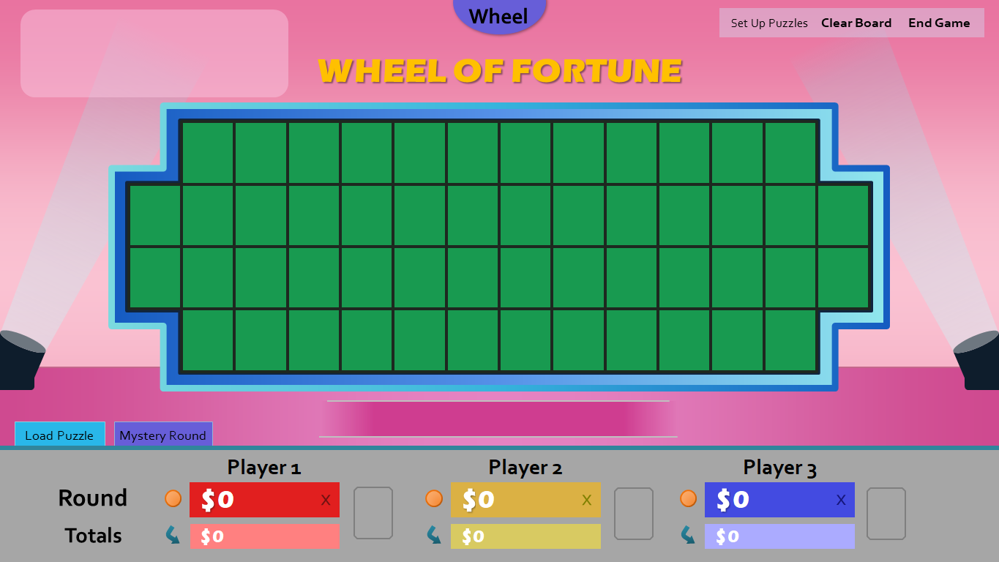
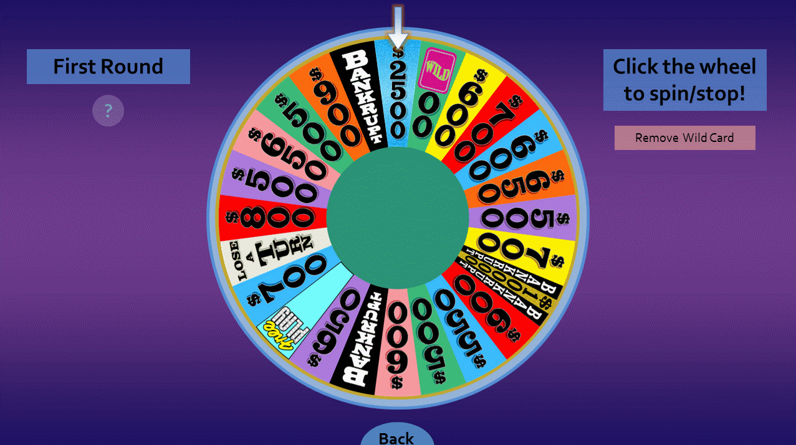
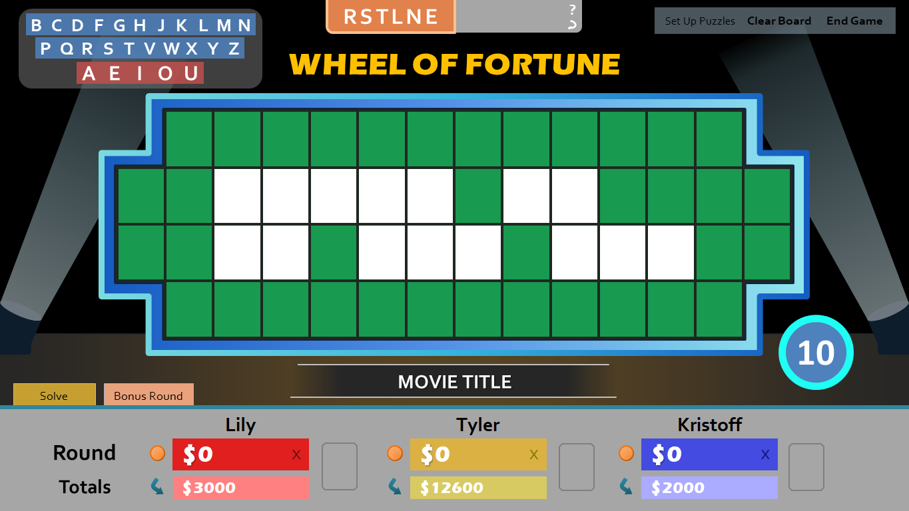
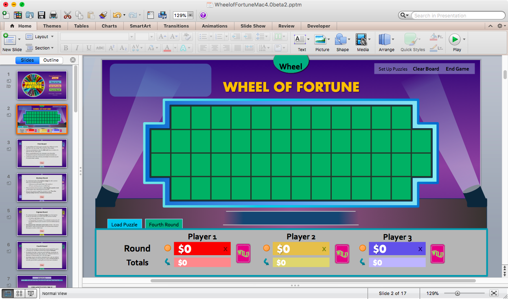

**UPDATE (April 6):** I've received quite a few comments about this template with this blog post. Note that this is not the latest version. Please leave any further comments about the template in general on [the main page](/wheel-of-fortune-for-powerpoint/). Thanks!

***

Welcome to **Wheel of Fortune for PowerPoint, version 4.0**. Get ready for a redefined Wheel experience, an all-new paradigm that shakes up how you and your contestants enjoy your game.

It is the product of months of enduring development and several milestone betas. In fact, this is the most ambitious update I've _ever_ made to a game.

For those who tested the betas, thank you. You can skip all the way down to the Developer Note if you'd like, or read on as I reprise the highlights of this release. If you're updating from the previous stable version, you're in for a treat. So much has changed since we last met, and I look forward to impressing you again with what's there to offer.

Alright, let's get the ball rolling, shall we?

***

### Remember the good ol' days when you...

* Had to individually light up puzzle board tiles in the beginning?
* Used finicky solution cards to remember how many M's were in your puzzle?
* Crossed your fingers you didn't screw up placing those S's in the wrong location of the puzzle board?
* Remembered (in order words, forgot) to type bad letters into the Letters Used box?

Well guess what? **Those days are over.** Pack your bags and get on moving; you're about to enter a whole new era of puzzle preparation and execution.

Introducing **Set Up Puzzles**, an all-new, inventive method to prepare your puzzles in advance. Using the in-game editor, you now input puzzles beforehand, then load them to the puzzle board when they're ready to be played.

You have twelve puzzle slots, enough for for a full-length game (and a few extras just in case). Editing puzzles is as easy as clicking a tile and typing the letter on it. If you type your words too far to the left or right, no worries; use the alignment arrows to shift rows left and right! You can also erase entire rows using the erasers, or delete the entire puzzle with the trashcan.

Once you've got all your puzzles registered to each number, you're ready to enter the puzzle board to start your game.

Well, things already look quite different here. The Calculator tab is gone (which I've hinted with the previous release), but what happened to the Letters Used box? Hold your horses, let's load one of the puzzles with the new **Load Puzzle** tab so you can see for your yourself.

As you can see, the puzzle loaded exactly the way I set it, just without the letters. Your contestants will fill in these missing letters using the new top left letter selector that just appeared.

It's Molly's turn, and she guesses the letter T. Remember, you as the host no longer have to recall how many and where the T's are in the puzzle. Just click on the letter T on the letter selector.

Ding! Just like the actual game show, the puzzle board tiles for the letter T have been highlighted in blue. Click the blue tiles, and the letter T will appear in each of them. **No need for solution cards anymore**, right? Also notice how the letter T has been removed from the letter selector. **Who needs a convoluted Letters Used box** when everyone can see all the available letters instead?

To wrap up the round, click the **Solve** tab to reveal the solution. The Load Puzzle tab will then reappear for you to load the next puzzle.

There's more to Set Up Puzzles than just the editor itself. Click the gear icon there, you'll see that for the first time, Wheel of Fortune for PowerPoint **has a settings panel**. Adjust the vowel price, house minimum, and/or how the puzzle board operates. You can also get a bird's eye view of every puzzle, or simply delete them all.

If you haven't noticed yet, there have been **various improvements to the user interface**. For instance, the default Studio backdrop has a new shade of purple. Player scores are now white, just like in the actual game show. Categories are now capital-enforced like the actual game show. Oh, and the disastrous Valentine's Day backdrop from before? I redid the colors so that it's more usable and vibrant.

There are several other design adjustments, but I might sound too nit-picky if I kept going. So I'll leave the rest up to you.

The wheels have also seen some work in this release. The first adjustment is that **the wheel now lands on a randomly computer-generated space**. What's more, **it is now possible to remove the wild card and mystery wedges from the wheel**! This allows for more interactive wheels and the possibility of of adding additional cards/wedges in future versions of the game.

One step closer to a complete game, Wheel of Fortune for PowerPoint **now supports the bonus round**! Accessible via the round tabs, a dedicated RSTLNE button reveals all those letters in the puzzle. The contestant would then select three consonants and a vowel, which would appear on the other side of RSTLNE. Once these letters are selected, click these letters to reveal them in the puzzle. Use the ten-second timer on the bottom right to round off the bonus round.

Arguably the best part of this release is that a new audience finally gets to join in the Wheel of Fortune fun. For the first time ever, **introducing PowerPoint for Mac support**!

I plan to maintain a Windows and a Mac version of Wheel of Fortune for PowerPoint. Here are the differences in the Mac version:

* Anything that involves editing text requires input boxes. This includes the Set Up Puzzles editor, player names, etc.
* Some fonts are different so they work on macOS
* You can run animation triggers, but you can't edit them. In order to fully edit Wheel of Fortune for PowerPoint, you'll still need PowerPoint for Windows.

Everything else should be feature identical with the Windows version for now. But since PowerPoint for Windows has more features than the Mac, there may be feature divides in the future. I'll have to figure out how to handle that if the need ever arises.

### Minor Changes

* Transferring totals now zeroes out the other players' round totals
* Slightly enlarged player name space
* Alignment fixes using PowerPoint's align center feature
* Option to wipe all puzzles/scores on exit. **Wheel of Fortune for PowerPoint now recommends saving** to preserve puzzles prepared with Set Up Puzzles.

### New video guide

<iframe title="Wheel of Fortune for PowerPoint video tutorial" allowfullscreen="" frameborder="0" height="315" src="https://www.youtube.com/embed/vNqHYk3FgiQ" width="560"></iframe>

## Developer Note

With this being my most ambitious update, there were several ups and downs during development. Implementing all the ideas was quite the challenge, from writing the VBA to simply knowing, "is this even possible in PowerPoint?" Multiple times would I get far into a feature, only to realize that PowerPoint had a limitation that prevented my original plan from happening in the first place.

This played a central theme during development, and with the long development cycle, it began to put a toll on me. Thankfully things came through in the end for the most part, but my mind couldn't help but wonder, "why did I put myself through this?"

That's why I'd like to graciously thank all the beta testers for this release, whether you were a contestant in one of my playtests or someone I haven't met in real life. You guys' joyous comments and smiles as you played made each of my days and gave me all the encouragement I needed to finish. Most importantly, you playtesters played along well with all the bugs. Even when I wasn't thrilled witnessing them, it looked like you guys still had a great time. You guys taught me that a game is not defined by its bugs; it's the fun that counts.

With that said, _I'm exhausted._ It's time for me to take a much-needed break from this project. Need not worry; Wheel of Fortune for PowerPoint development is far from over. I still have several new ideas in the backlog, many of which I came up with throughout the beta cycle (and hinted throughout the beta release notes). When the time is right, I'll remember what I learned here and stand up to the challenge.

Hope you enjoy version 4.0!

\~Tim's Slideshow Games