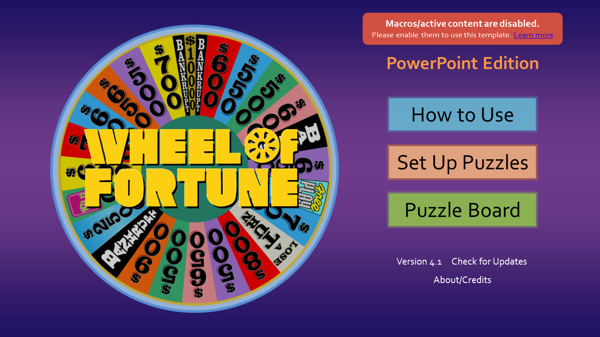

**UPDATE (8/31)**: Version 4.1.1 updates the links to the new site name: _Games by Tim_.

***

Time for another Wheel of Fortune for PowerPoint release!

Version 4.1 primarily focuses on refinements here and there. It also adds a feature originally planned for the 4.0 release.

## What's Changed

* **Puzzle Swapping**  
  Created a puzzle in slot 1 but want to move it to slot 3 instead? Now you can with the new puzzle swap feature. In the Show All Puzzles slide, use the new arrow buttons to sort your puzzles to your liking.

* **Macro Checking**  
  Many users have told me that Wheel of Fortune for PowerPoint doesn't work. Almost every time, it's because they unknowingly had macros disabled.  
    
  To save each of us the trouble, Wheel of Fortune for PowerPoint now checks if macros are enabled. If a user clicks on any of the title slide buttons with macros disabled, a alert box will appear with a link to the [macro troubleshooting post](/blog/powerpoint-game-not-working-how-to-enable-macros/).

* **Refinements**
  * Multiple alignment fixes
  * Grammar fixes for round explanations
  * The trashcan in Set Up Puzzles now animates when clicked
  * Fixes a bug that prevented editing the vowel price or house minimum on the first try

## Moving Forward

As I [mentioned before](/blog/operation-powerpoint-to-web-continues/), I want to transition this project from PowerPoint to the Web. This means at some point, you will be able to create and play Wheel of Fortune games straight from your Web browser.

As such, Wheel of Fortune _for PowerPoint_ is now in maintenance mode. I will work on bug fixes and refinements if need be, but don't expect any more features until the Web version arrives (which will take a while).

I greatly look forward to the Web release, and I hope you do too. For now, I hope you enjoy this new PowerPoint release.