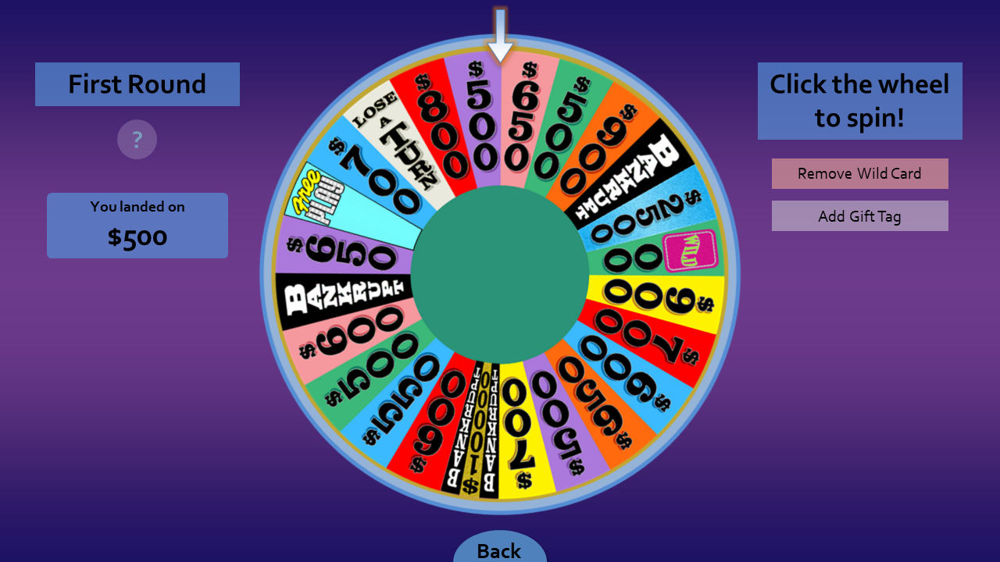
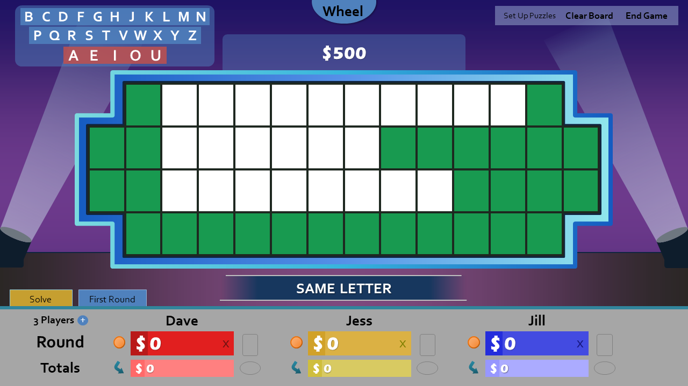
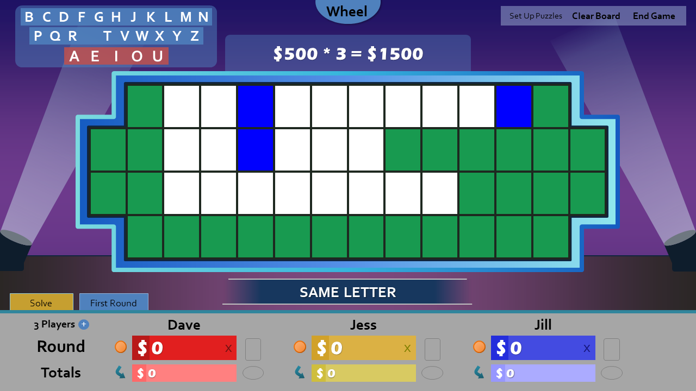
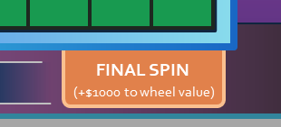
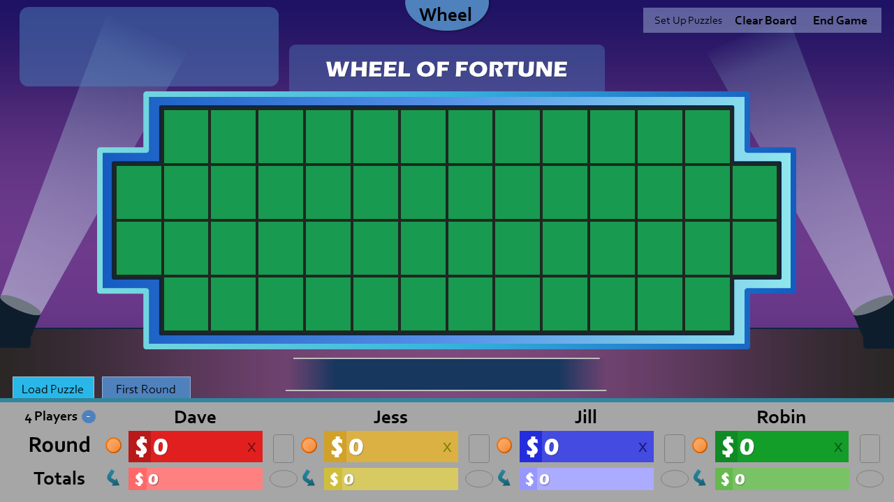
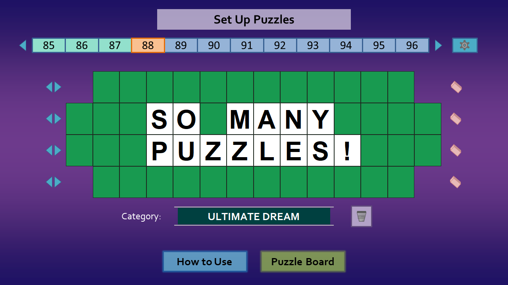

In [the last feature update](/blog/wheel-of-fortune-for-powerpoint-version-4.1/), I mentioned I would discontinue Wheel of Fortune for PowerPoint in favor of a web-based release. Well, that web version's still long ways away, and I want new features **now**. Introducing Wheel of Fortune for PowerPoint version 5.0, an absolute whizbanger brimmed with features on the back burner for over two years!

## Vastly-improved score keeping

Wheel of Fortune for PowerPoint's largest pain paint has been the score keeping. For years, hosts had to rely on mental math to change player scores, heavily detracting from the actual game. Although previous updates [tried to reduce the mental strain](/blog/wheel-of-fortune-for-powerpoint-version-3.2-takes-stage/), score keeping ultimately remained clunky and unenjoyable.

Well that's all about to change in a flash. Dare I say it, **score keeping's actually good now.**

It all starts with **the new wheel mechanism**. Previous versions relied on two clicks to spin the wheel, and its animations [got gimped in version 4.0](/blog/wheel-of-fortune-for-powerpoint-version-4.0-rc-release-notes/) due to issues with randomness. The new mechanism takes one click, and it spins beautifully.

The real attraction is that **the wheel tells you where you landed on.** For starters, that means no more squinting on the wheel in edge cases. Even better, it's what Wheel of Fortune for PowerPoint needs to keep score _for you_.

We're back at the puzzle board, which looks a bit different. Gone is the "Wheel of Fortune" button, replaced with an all-new **Value Panel**. Right now, the value panel holds the wheel value we just spun. Now let's guess a letter.

Bam! Three letters in the puzzle, which adds up to $1500. All you have to do now is click on a player's round score to automatically add $1500. **It's that simple.**

What if you rather not use the built-in wheels and prefer to [spin your custom-made wheel](https://www.youtube.com/watch?v=jCHE-SVpfRg)? Not a problem. Simply click the Value Panel to manually set the spun wheel value!

How about the Final Spin round, which adds $1000 per consonant? There's a button for that, which takes care of that business.

And if all else fails, click a player's dollar sign to manually adjust their score.

Hopefully I've convinced you that the Value Panel's a godsend, with its simplicity and top-notch flexibility compared to the competition. But wait, there's more!

## The Essence of Sound

Sound effects arrive to Wheel of Fortune for PowerPoint, dramatically improving the game's immersion!

The following sound effects are supported:

* Wheel spin
* Guessed letter correct
* Guessed letter wrong
* Load puzzle
* Puzzle solved

The included sound effects are custom-sourced, rather than the official tracks, for copyright reasons. You can, should you choose, customize each sound effect in Settings.

## Ready, player 4!

By far the most requested feature since day one is the ability to add more players. Starting now, your fourth friend can finally join in the fun!

Sure, four players isn't conventional for Wheel of Fortune, but that's why these game show templates have so much potential. We get to address what the actual show won't!

## Bursting the 12-puzzle limit

Ever wanted to have more than 12 puzzles for your Wheel of Fortune for PowerPoint game? Now you can. What's the limit? **There is none!**

Simply click the arrows next to the puzzle numbers to add more puzzles. Make as many puzzles as you want, or until PowerPoint crashes, whichever comes first!

## A barrage of settings

Version 5.0 also includes a handful of new settings to fine-tune your Wheel experience.

* You can now disable the $10,000 wedge if that's not your jam.
* You can now adjust the wheel values to the current values ($500 minimum) or the classic values ($300 minimum). You may find the classic values more fun to play with due to its wider variety of numbers.
* You can now toggle the gift tag on the wheel in case you want to offer additional prizes for your next game. This is disabled by default.
* As mentioned above, there's a new section to customize sound effects.

## Other cool changes

* Clicking any lit puzzle board tile, regardless if it's blue, will now reveal its letter. This allows for **unofficial toss-up round support**.
* The wheel/puzzle board transition has changed from push to fade in an effort to improve speed and reduce motion sickness.
* The Letter Selector's slightly bigger to reduce the chance of misclicks.
* The How to Use slides now have a "Tips & Tricks" section.
* All message boxes now have a title.
* All the VBA now supports **Option Explicit** to reduce chance of errors.
* All links have been updated to the new Games by Tim site's style, and I made various grammar adjustments.

## Deprecations

The following features have been dropped in version 5.0:

* **PowerPoint 2007 support.** Much of the new features requires code incompatible with PowerPoint 2007, so support had to go. You can always [download the latest release for PowerPoint 2007 here](/wheel-of-fortune-for-powerpoint-older-versions/). \[PS, There's a new version (4.1.3) waiting for you!\]
* **Quick Add.** No longer necessary due to the superior Value Panel.
* **Graphical Puzzle Swap.** Due to limitless puzzles allowing multiple "All Puzzles" slides, I had to rewrite Puzzle Swap to use a basic input box for selecting numbers instead.
* **The "Wheel of Fortune" button.** The Value Panel takes this button's place. You can still configure the puzzle board backdrop in Settings.

## New video tutorial

As version 5.0 functions differently enough from before, a new video tutorial's in order. Fortunately, I've delivered.

 <iframe title="Wheel of Fortune for PowerPoint video tutorial" allowfullscreen="" frameborder="0" height="315" src="https://www.youtube.com/embed/QVPlyuG7L7s" width="560"></iframe> 

The new video's to the point, shaving more than half the runtime of the previous video!

## Thank you

I remain surprised by how much attention Wheel of Fortune for PowerPoint receives. Thank you all 70,000+ downloaders for your support. You all deserve this amazing update!

Now will this be the final Wheel of Fortune for PowerPoint update? I honestly couldn't tell you, but let's just say I'd like to save some tricks on my sleeve for that glorious web release.