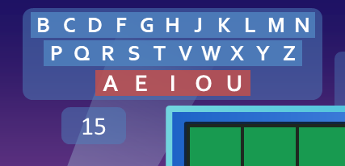

Well, that was quick. Just three weeks after [the successful version 5.0 release](/blog/wheel-of-fortune-for-powerpoint-version-5.0-an-absolute-whizbanger/), version 5.1 is ready to roll! That's what happens when you host games and discover all sorts of improvement areas.

## A way to enforce time limits

In Wheel of Fortune, you can't spend too long guessing letters and making decisions. Normally, I'd use my fingers as a countdown for players, but that wasn't feasible over video call. Surely there has to be a better way to track time.

Introducing the **shot clock**, an optional timer that helps enforce time limits on player decisions.

Clicking the shot clock will start a countdown. Clicking it again will reset the clock. You can choose the time limit in Settings, ranging from 1 to 30 seconds.

The shot clock does not affect how the game runs, which means you the host retain control of the rules. For instance, you can let a player slide by a few seconds and/or exempt certain players from the clock!

## Improved toss-up handling

Version 5.0 enabled toss-up support, albeit hastily. Version 5.1 adds additional measures to smoothen the toss-up experience.

* You can now start a toss-up only if no letters have been guessed in the puzzle.
* If you start a toss-up with nothing in the Value Panel, you can input the toss-up value at stake on the spot.
* During a toss-up, the Letter Selector hides from view.

## Shift up/down

In the puzzles editor, you can now shift puzzles up and down. This is useful if say you wanted to append an adjective to a puzzle but already filled the top puzzle row.

This feature has been backported to version 4.1.4 for PowerPoint 2007 users.

***

Thanks for checking out Wheel of Fortune for PowerPoint version 5.1! I look forward to your feedback on the new features.