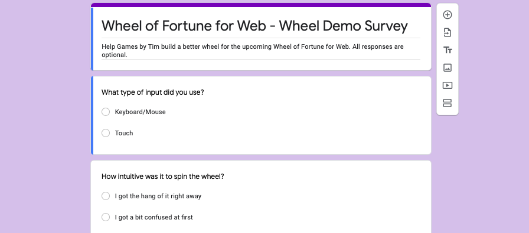

Now that the [wheel demo](https://wheeldemo.gamesbytim.com/)'s been out for a couple weeks, I've received a decent amount of responses from you guys about how to improve the wheel. Below is a summary of the feedback and how I plan to respond to it.

* **About a third of you used touch to spin the wheel.**  
  Although the Wheel of Fortune project is designed for keyboard/mouse, that's a nontrivial amount of touch users. I'll definitely need to keep touch-friendliness in mind, particularly in tablets (as they can project to a projector) as I continue to develop Wheel of Fortune for Web.
* **On average, you guys thought it was a bit too difficult to max the strength meter.**  
  Although I liked the challenge, I can see why some of you would find it too hard. That's why I've decided to strike a balance. Although I toned down the meter's exponential speed (so it moves at a more constant pace), I slightly lowered the time it takes for the meter to move from 0 to 100%. This should help users achieve max strength quicker while making the final strength appear more predictable.
* **About half of you said that the wheel physics felt off, especially at max speeds.**  
  After giving the wheel a few more spins, I can agree with the consensus. You see, the wheel as it currently stands can spin at up to 10 rotations. Problem is, 10 rotations is a lot, and in order to ensure that you can see the wheel slow down nicely, I overcompensated with the wheel's rate of speed decrease.

    
  To resolve the overcompensation, I plan to reduce the max wheel rotations to 5 or 6 (not fully decided yet). I initially thought this decrease would make the max speeds not look as appealing, but then I realized as it currently is, I couldn't tell the difference between 60% and 100% strength anyway. I will also adjust the rate of speed decrease accordingly and perhaps make the wheel slowly speed up as it starts spinning for visual effect (as someone suggested that).

I'd like to thank all of you who participated in the survey, and if you haven't sent your thoughts yet, [there's still time to do so](https://forms.gle/oBiGSo1aivxQbdHp7). **I will close the wheel demo survey sometime after February 10.**