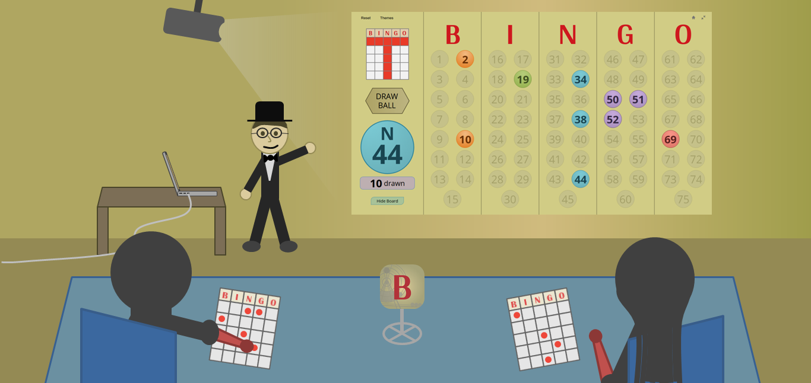

**Bingo Master Board** helps you host and manage your own Bingo games. You can:

- **Randomly draw** and project Bingo balls
- **Display** the amount of balls drawn or remaining
- **Set** a winning pattern
- **Change** the look of the board with themes
- **Hide** drawn Bingo numbers for a tougher game
- **Manually edit** the board if you're drawing balls separately

Bingo Master Board is designed for fullscreen on the Web. This version is the successor to Bingo Master Board (PowerPoint) and Bingo Master Board PLUS (PowerPoint).

Supports the latest versions of Edge, Firefox, Chrome, and Safari (including the iPad).

**Internet Explorer is not supported.**

Find any bugs? Read the [GitHub README](https://github.com/TimTree/bingo-master-board/#readme) for more details.