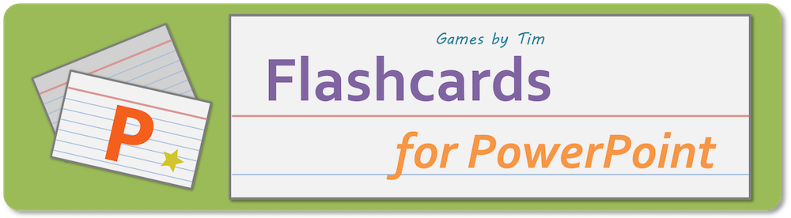

Your next exam, made easier to study for with PowerPoint.

* **Create flashcards** using PowerPoint's editing view. You can use text and/or images.
* In slide show view, **randomly shuffle your flashcards** to test your memory.
* **Control how your flashcards shuffle and display** with built-in settings.
* Includes **sound effects** and a **star system.**

Rather than simple randomization, Flashcards for PowerPoint shuffles the order of your cards. This ensures that you'll see all of your cards once before a card you've already seen appears again.

Can't think of any flashcard ideas? [Try this example set](https://github.com/TimTree/flashcards-for-powerpoint/releases/download/v1.2.1/FlashcardsPPTExample1.2.1.pptm) about the Periodic Table of Elements (up to Uranium).

**Compatible With**

* Windows: PowerPoint 2007 or newer
* Mac: PowerPoint 2011 or newer

_You'll need to enable macros for this project to work._

**PowerPoint for Mac users:** If you encounter issues with hyperlinks, rename the file to include spaces. [More info here](/blog/fixes-for-hyperlink-issues-on-powerpoint-for-mac/)

## License

To help you freely create and share your flashcards, this project uses the [**Creative Commons Attribution 4.0 International License**](https://creativecommons.org/licenses/by/4.0/). This means you can distribute and adapt this project for commercial and noncommercial purposes as long as you credit **Games by Tim** for the original work.