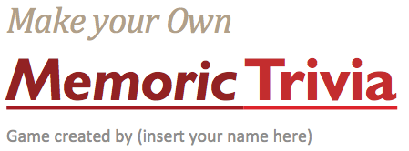

Ever wanted to make your very own Memoric Trivia game? Well, your dream just came true. Using the **Make your Own Memoric Trivia** software, all you have to do is follow the instructions via the PowerPoint notes section, and you'll be ready to have a finished product in no time! It's easy! It's fun! You and your friends will have a blast (if you make a good Memoric Trivia)!

Feel free to post the Memoric Trivia's you make with this template in the Comments. _You may also post your game in your own website, as long as you don't remove the bottom header in the first slide_.

**Compatible With:**

* Microsoft PowerPoint 97 (XP (2002) or later recommended)
* PowerPoint for Mac 98 (v. X (2001) or later recommended)

  _Sorry PowerPoint Viewer users, but you're unable to edit PowerPoint presentations._