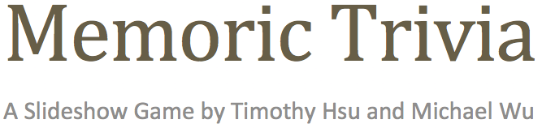

Memoric Trivia is a slideshow game I created with my friend, Michael Wu. The point of the game is to answer 10 trivia questions while still remembering a PIN number given at the beginning of the game. After answering all 10 trivia questions, you will be taken to a PIN pad, where you must insert the correct PIN number in order to win the game. Interesting, is it? This game is good if you want to test how good your memory is.

Note: I wasn't the one who thought having to restart the entire trivia if you get a wrong answer was a good idea.

Update - A new reduced pain edition has just been released! Instead of having to restart the entire trivia, you'll just have to wait 7 seconds if you get a wrong answer.

**Compatible With:**

* Microsoft PowerPoint 97 or later
* PowerPoint for Mac 98 or later
* PowerPoint Viewer 97 or later
* Any version of Keynote