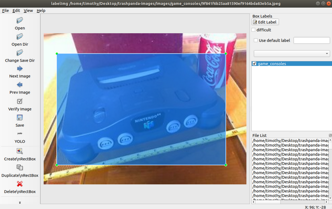

Recycling isn't always straightforward. What do those numbers on plastics mean? What should I do with that broken refrigerator? How can I dispose this abstract object I can't tell what it is?

On top of that, recycling regulations differ across cities. Did you know some cities allow you to recycle items that other cities prohibit? The same goes for compost. This leads to a lot of incorrectly recycled items, placing unnecessary impact on the environment.

That's where Trash Panda comes in. Using your location and camera, the web app can identify the item you have and specifically point to you if, how, and where to recycle it. Prefer not to use the camera? You can search in Trash Panda's extensive database, which also offers interesting tidbits about your items to recycle. **Trash Panda helps you improve your recycling habits** so you can rest assured you're doing the environment justice.

> **Note:** Trash Panda is part of Lambda School Labs, in which I played a role in. Since I'm not in charge of Lambda School Labs, I cannot directly provide further bug fixes/improvements.

## Compatibility notes

* **Trash Panda recommends location and camera permissions** so it can properly identify how to recycle items in your area and use the image recognition model.
* **Trash Panda is meant for mobile devices** due to the nature of how the app is used, particularly the camera. Desktop users will see a splash screen prompting users to load the page on their phone.
* **On iOS, Trash Panda only works on Safari** since only Safari can use camera permissions.
* **On Android, you can install Trash Panda on the** [**Google Play Store**](https://play.google.com/store/apps/details?id=com.thetrashpanda.twa)**.**

## My role in Trash Panda

The original Trash Panda team consisted of four web developers, four data scientists, two UX designers, and a project lead. **I worked as one of the four data scientists.**

(That's right; despite this site's portfolio of web-based works, I wanted to try something different. There's a lot of different things to learn in the data science field!)

To build Trash Panda's image recognition model, us data scientists first needed to download multiple thousand images of recyclable products. Then, for each and every image, we had to draw a bounding box that labels the exact item we're trying to identify.

(Example of a bounding box. We want to identify the Nintendo 64, not the soda can.)

Sounds tedious? That's because it is. Thankfully we're computer scientists and know how to automate some things.

* **For downloading,** we wrote python scripts that can automatically scrape images from Bing and Google Images. It works well, but we had to be careful about search queries (cork is a wine bottle cap, as well as a name of a city).
* **For drawing bounding boxes,** we wrote a large python script that programmatically labels images. Some images, like those with just the item and a transparent background, easily label well with the script. Other images, like a white piece of paper on a white table, not so much. Although our script helped us save lots of time, we still had to manually label thousands of images.

Once we got all our images downloaded and labeled, we used YOLO, an object detection neural network, to train our model. In a nutshell, the computer gathers information about what a specific item looks like from each labeled image and tries to generalize what it learned as a math algorithm. The training process requires a large amount of GPU power, and as such, we used a cloud computer, AWS SageMaker, to train the model.

Once the training finished, we got a single weights file that contains all the math algorithms. We deployed this file to a server, which end users utilize to determine the recyclable items in their own images.

If you want to learn more about image recognition, [this site](https://pjreddie.com/darknet/yolo/) explains more about the YOLO neural network.

## Video demo (recorded by Trevor Clack)

 <iframe title="Trash Panda demo" allowfullscreen="" frameborder="0" height="315" src="https://www.youtube.com/embed/YbEzwob7PLw" width="560"></iframe> 

## The team

Trash Panda was made possible thanks to these amazing team members.

* **Trevor Clack** (Data scientist) - [Portfolio](https://tclack88.github.io/), [LinkedIn](https://www.linkedin.com/in/trevor-clack-774696184/), [Trash Panda writeup](https://tclack88.github.io/blog/personal/2020/03/07/trash-panda.html)
* **Timothy Hsu** (Data scientist) - [Portfolio](/), [LinkedIn](https://www.linkedin.com/in/hsutimothy/)
* **Vera Mendes** (Data scientist) - [Portfolio](https://veramendes.github.io/), [LinkedIn](https://www.linkedin.com/in/vera-mendes/), [Trash Panda writeup](https://veramendes.github.io/2020-03-08-The-Trash-Panda/)
* **Tobias Reaper** (Data scientist) - [Portfolio](https://tobias.fyi/), [LinkedIn](https://www.linkedin.com/in/tobias-reaper), [Trash Panda writeup](https://tobias.fyi/workshop/trash-panda/)
* **Mark Artishuk** (Web developer) - [Portfolio](https://www.markartishuk.com/), [LinkedIn](https://www.linkedin.com/in/mark-artishuk/)
* **Colin Bazzano** (Web developer) - [LinkedIn](https://www.linkedin.com/in/colin-bazzano-6a6250114/)
* **Mark Halls** (Web developer) - [Portfolio](https://markhalls.dev/), [LinkedIn](https://www.linkedin.com/in/mark-halls)
* **Carlo Lucido** (Web developer) - [LinkedIn](https://www.linkedin.com/in/cjlucido/)
* **Lynn Baxter** (UX designer) - [Portfolio](https://lynnb.design/), [LinkedIn](https://www.linkedin.com/in/lynnmariebaxter/), [Case study](https://lynnb.design/trash-panda)
* **Kendra McKernan** (UX designer) - [Portfolio](https://www.kendramckernan.com/), [LinkedIn](https://www.linkedin.com/in/kendra-mckernan/), [Case study](https://www.kendramckernan.com/work/recycle-iq)
* **JT Kernan** (Project lead) - [LinkedIn](https://www.linkedin.com/in/john-timothy-kernan-b9358966/)