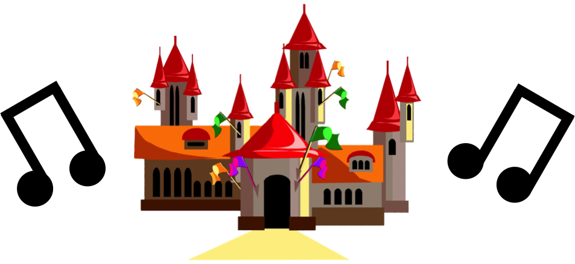

Here's an old piece of music I built way back in 2013. It used to be uploaded on Newgrounds, but I've finally been able to locate the MP3 to upload here.

Below is the original description of Medieval Start from Newgrounds, along with the music itself.

***

**The beginning of a medieval adventure**

This is my first digital song I ever created. At first, I wasn't aiming for any specific genre, but as I progressed, my peers felt like it was suited for medieval music. The music is created in Garageband '11 using five different instruments. Enjoy, and don't forget to leave a review!

Tags  
beginning, first, medieval, peaceful

To download the MP3, right click the audio player and select "Save audio as."

<audio controls=""> <source src="https://timtree.github.io/music/MedievalStart.mp3" type="audio/mpeg"> Please update your browser to hear this song. </audio>

Castle image taken from [https://www.publicdomainpictures.net/en/view-image.php?image=169589&picture=castle-15](https://www.publicdomainpictures.net/en/view-image.php?image=169589&picture=castle-15), CC0 Public Domain.