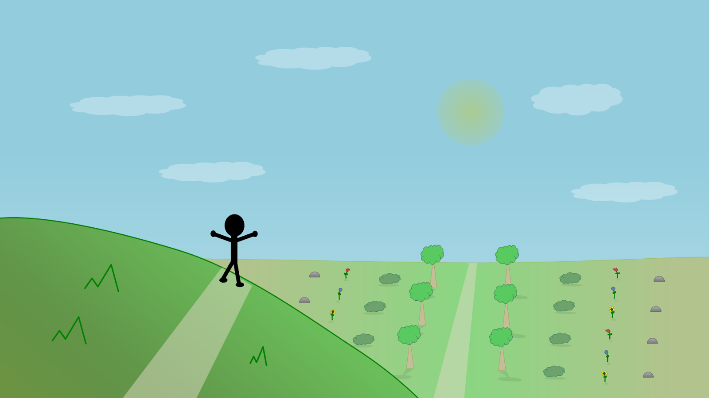

Behold, a piece of artwork I've created back in June 2012! Vista Point (V1) was created using PowerPoint shapes. There's not much to say about this other than that I created it out of boredom.

So enjoy! Click on the image to make it bigger.

## [Download source file (pptx)](https://drive.google.com/uc?export=download&id=1O1HHdrC1TySj5i0cSW9eLhuS3fcCnuFd)

Licensed under the [Creative Commons Attribution 4.0 International license](https://creativecommons.org/licenses/by/4.0/)
