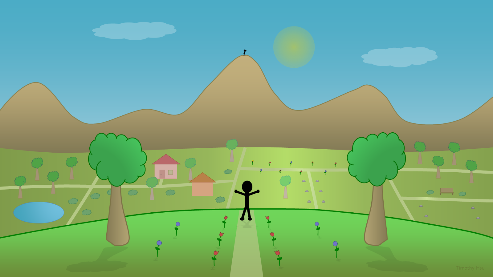

Vista Point V2 was completed on October 2012 and was created using PowerPoint shapes. The goal was to improve upon the first Vista Point artwork by adding more detail, making the colors more vibrant, and improving the use of gradients.

Click on the image to make it bigger.

## [Download source file (pptx)](https://drive.google.com/uc?export=download&id=1PYnzbTbKD3fYBk_p20f1lbEW_TPT5tBJ)

Licensed under the [Creative Commons Attribution 4.0 International license](https://creativecommons.org/licenses/by/4.0/)
