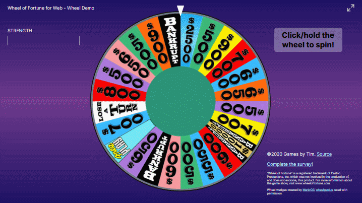

## [wheeldemo.gamesbytim.com](http://wheeldemo.gamesbytim.com/)

### [Source Code](https://github.com/TimTree/wheel-of-fortune-wheel-demo)

Here you'll find a tech demo of the wheel I intend to use for Wheel of Fortune for Web, the upcoming replacement for [Wheel of Fortune for PowerPoint](/wheel-of-fortune-for-powerpoint/).

Compared to the PowerPoint wheel, the Web wheel starts spinning from where the wheel last landed. It also uses the [crypto-random API](https://developer.mozilla.org/en-US/docs/Web/API/Crypto/getRandomValues) to securely determine where the wheel stops.

## **Survey**

From January 20 to February 10, 2020, I ran a survey on the wheel demo to figure out how to further improve the wheel. [Click here for a summary of the survey results.](https://www.gamesbytim.com/blog/wheel-of-fortune-wheel-demo-survey-analysis/)

## **To Do**

* Add multiple wheel types to choose from
* Add the wheel's second layer (wild card, Mystery wedge, etc)

Note that I'm long ways away from releasing Wheel of Fortune for Web. I'm just sharing these types of demos in the meantime.

## **License**

Wheel of Fortune for Web - Wheel Demo is licensed under the GPL-3.0.

“Wheel of Fortune” is a registered trademark of Califon Productions, Inc, which was not involved in the production of, and does not endorse, this product. For more information about the game show, visit www.wheeloffortune.com.

Wheel wedges created by [MarioGS](http://buyavowel.boards.net/thread/6608/all-wheel-wedges)/[wheelgenius](https://wheelgenius.deviantart.com/), used with permission.